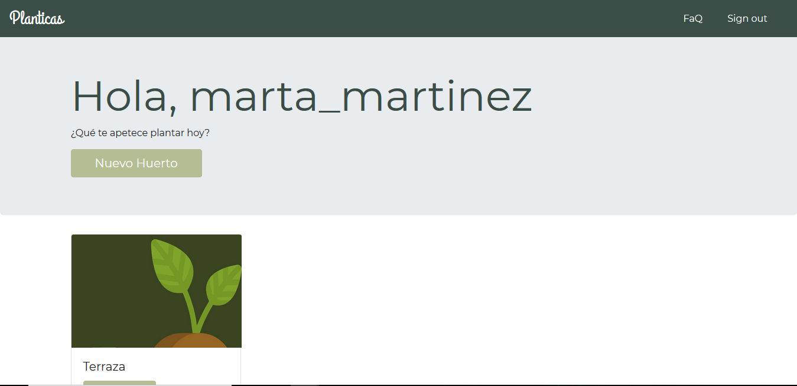
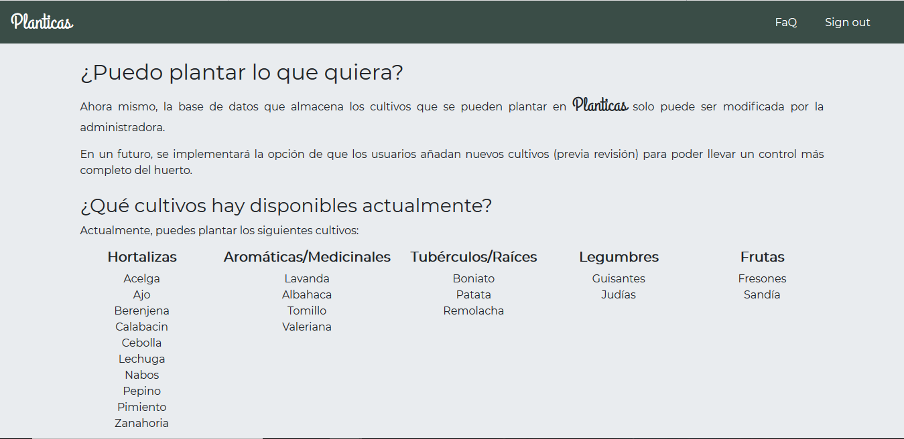

# :seedling: CRUD HUERTO 
CRUD para organizar un huerto.
Cada usuario podrá gestionar su huerto y añadir nuevos cultivos.  

Si estás buscando la primera versión, haz click en Branch y busca el Tag v1.0, ahí está la versión anterior.

# Nuevas funcionalidades

## Nueva pestaña FaQ

## Display de cultivos disponibles

A través de un HashMap de ArrayLists, muestra los cultivos disponibles clasificados por tipo.

 
