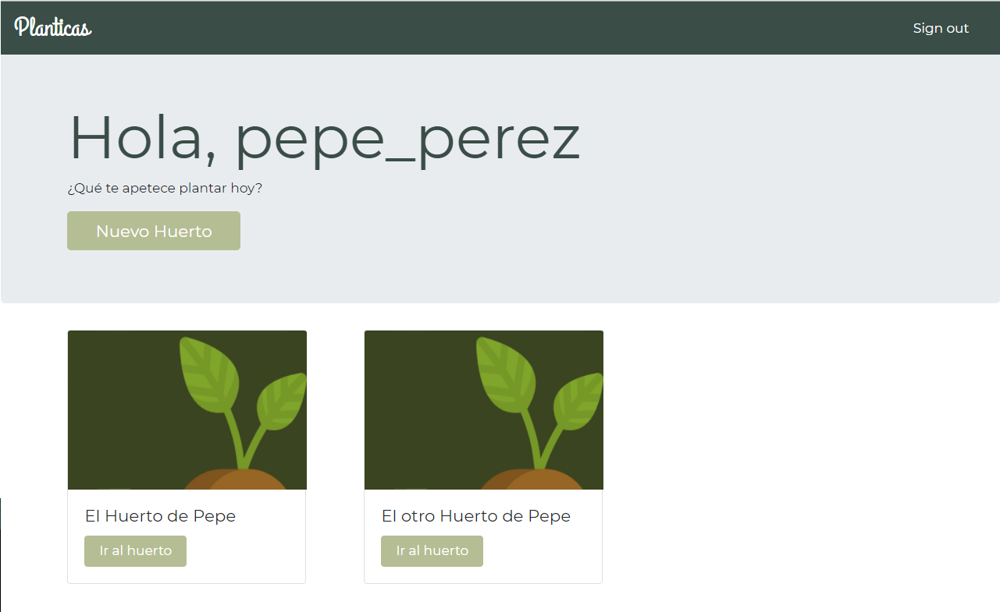
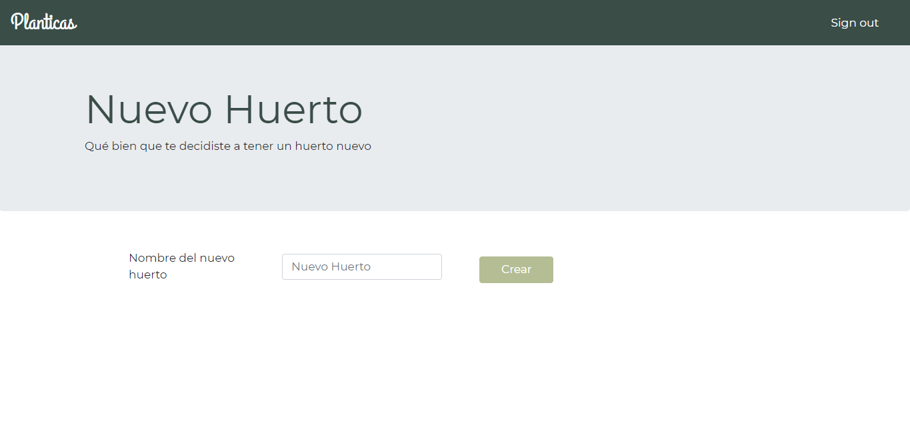
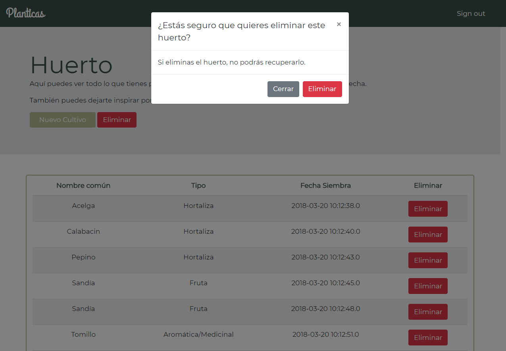
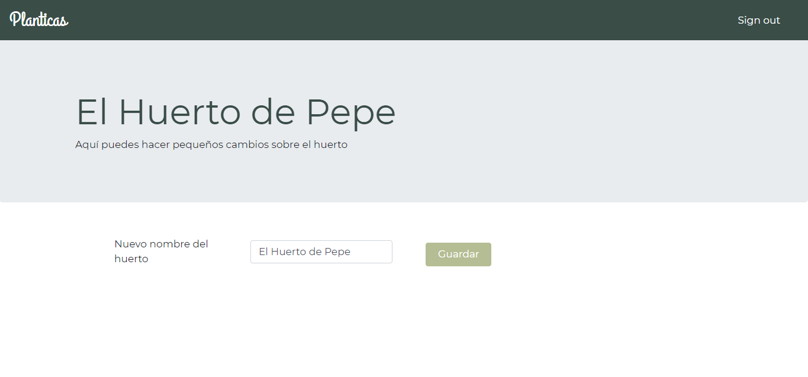
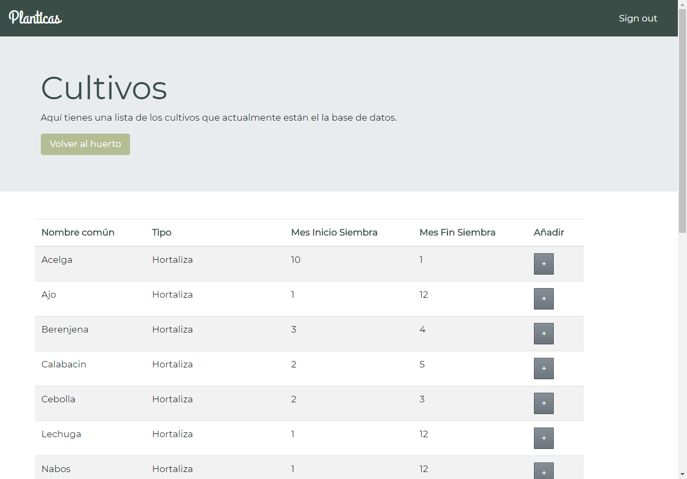

# :seedling: CRUD HUERTO 
CRUD para organizar un huerto.
Cada usuario podrá gestionar su huerto y añadir nuevos cultivos.  

## Login
 
 |Login|Error Login|
 |-----|-----------|
 ||  Muestra error si no está registrado o las credenciales son incorrectas|
 
 ## Registro
 
 |Registro|Error en el Alias|Error en el E-mail|
 |--------|-----------------|------------------|
 ||  Muestra errores diferentes si el alias|  o el correo están ya en la BDD|
 
 ## Home
 
 ## Nuevo Huerto
 
 ## Huerto
 
 |Huerto|Eliminar Huerto|Cambiar Nombre|
 |------|---------------|--------------|
 |  Vista de los cultivos que tenemos plantados|  Al eliminar el huerto, aparece una advertencia|  Clicando "Huerto" se puede modificar el nombre|
 
 ## Cultivos
 
 
